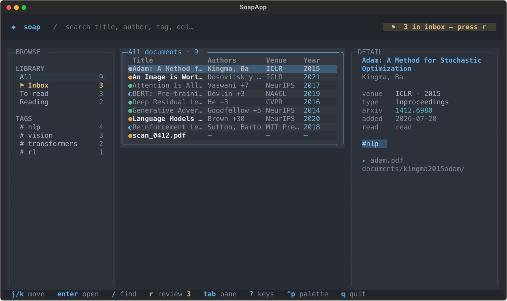
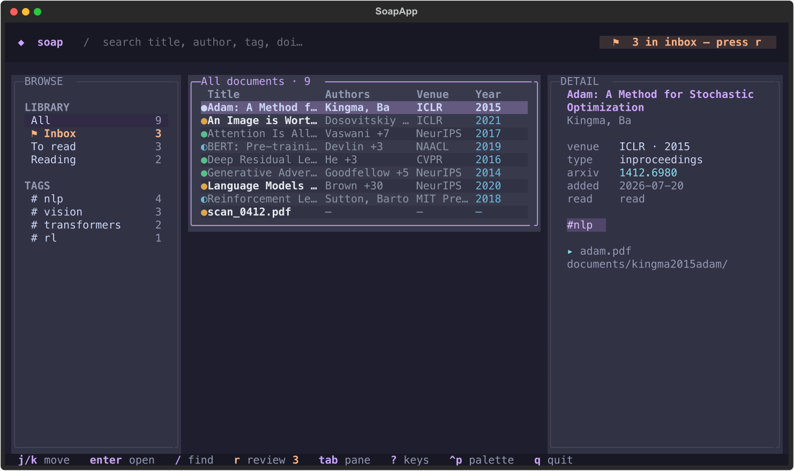

# soap

**S**imple **O**rganisation **A**pp — a reference and document manager for the terminal.

soap keeps a personal library of papers, books, and PDFs on disk in a form you can
read, grep, and version-control: every document is a plain `info.yaml` file, and a
SQLite index (rebuildable from those files) makes the library fast to browse and
search. Add documents from a local file or an identifier (DOI, arXiv, ISBN), let soap
fetch the metadata, and confirm anything it isn't sure about through a `needs_review`
inbox. Browse it all in a keyboard-driven TUI.


## Why soap

- **Your files stay yours.** The on-disk `info.yaml` is the source of truth. The
  database is just an index — delete it and it rebuilds. Nothing is locked in a
  proprietary store.
- **Metadata you can trust.** Every add records *where* its metadata came from and a
  confidence score. Low-confidence adds land in a review queue instead of silently
  polluting your library.
- **CLI and TUI, one library.** Script bulk imports on the command line; browse and
  review interactively in the TUI. Both operate on the same files.

---

## Requirements

- [**uv**](https://docs.astral.sh/uv/) — used to manage the environment and run soap.
- **Python ≥ 3.14** (uv will fetch it for you if needed).

## Install & run

soap runs straight from a checkout with `uv`:

```bash
git clone <this-repo> soap
cd soap
uv run soap --help
```

`uv run soap …` resolves dependencies and runs the `soap` entry point
(`soap = "soap.main:app"`). Every command below is invoked that way.

### Install a standalone binary

Once a [GitHub Release](https://github.com/GhifariArsa/soap/releases) is published,
a single command downloads the right binary for your platform, verifies its
checksum, and drops it in `~/.local/bin`:

```bash
curl -fsSL https://raw.githubusercontent.com/GhifariArsa/soap/main/install.sh | sh
```

Supported targets: macOS (arm64, x86_64) and Linux (x86_64, arm64). Pin a version
with `SOAP_VERSION=v0.1.0` or change the target dir with `SOAP_INSTALL_DIR`. On any
other platform, install from PyPI instead: `uv tool install soap-tui`.

> **Note:** the installer needs a published Release to download from. Until the
> first release is cut, use the `uv` methods above.

### First-time setup: `soap init`

```bash
uv run soap init
```

`soap init` prepares a machine to use soap. It:

1. Creates the library directory (default `~/.soap`, see [The library](#the-library)),
   with `inbox/` and `documents/` subfolders.
2. Writes a starter `config.yaml` with `always_review: true` (never overwriting an
   existing one).
3. Creates and initializes the SQLite index (`soap.db`).
4. Appends an `export SOAP_DIR=…` line to your shell config so soap always finds the
   same library.

```
✓ config       ~/.soap/config.yaml (always_review: true)
✓ library      ~/.soap
✓ created      inbox/ documents/
✓ database     soap.db (schema v1)
✓ shell        added SOAP_DIR to ~/.zshrc

Run `source ~/.zshrc` or open a new terminal to load SOAP_DIR.
```

Useful flags:

| Flag | Effect |
|------|--------|
| `--path <dir>` | Initialize the library at `<dir>` instead of the default. Overrides `$SOAP_DIR`. |
| `--shell auto\|zsh\|bash\|fish` | Which shell config to write the `SOAP_DIR` export into (`auto` detects `$SHELL`). |
| `--force` | Reinitialize even if a library already exists (backs up the old database first; **destructive**). |

Re-running `init` is idempotent: it never clobbers an existing `config.yaml` or
database unless you pass `--force`.

---

## Core concepts

### The library

A soap library is a single directory, resolved in this order:

1. `--path <dir>` on the command (highest priority).
2. `$SOAP_DIR` from the environment.
3. `~/.soap` (the default).

Inside it:

```
$SOAP_DIR/
├── config.yaml                 # library configuration
├── soap.db                     # SQLite index (rebuildable)
├── inbox/                       # staging area
└── documents/
    └── vaswani2017attention/    # one folder per document, named by citekey
        ├── info.yaml            # the authoritative record
        └── att.pdf              # the attached file(s)
```

**Disk is the source of truth.** Every mutation rewrites `documents/<id>/info.yaml`
first, then re-syncs the SQLite index. The index holds a denormalized copy of each
document plus its authors, tags, collections, and files for fast listing and search —
it can always be rebuilt from the `info.yaml` files.

### Documents

Each document is one `info.yaml` record. A typical file:

```yaml
# authors is a YAML list, one entry per line, each in "Last, First" form.
id: vaswani2017attention
type: article
title: Attention Is All You Need
year: 2017
authors:
- Vaswani, Ashish
venue: null
doi: null
arxiv_id: null
isbn: null
added_at: '2026-07-31T07:18:23Z'
read_status: unread          # unread | reading | read
source: manual               # crossref | arxiv | openlibrary | manual | local
confidence: 0.8
review_status: needs_review  # filed | needs_review
tags: []
collections: []
files:
- path: documents/vaswani2017attention/att.pdf
  mime: application/pdf
  sha256: 2d711642…
```

### Citekeys

The document `id` is a citekey of the form `{lastname}{year}{titleword}`
(e.g. `vaswani2017attention`), derived from the resolved metadata and made unique and
filesystem-safe. It names the document's folder. A brand-new `add` derives a fresh
citekey; correcting a document during review **keeps** the existing key (the folder is
never renamed).

### Source & confidence

Every document records how its metadata was resolved and a confidence score for that
source:

| Source | Confidence | Where the metadata came from |
|--------|-----------:|------------------------------|
| `crossref` | 0.95 | Crossref (via DOI) |
| `arxiv` | 0.90 | arXiv |
| `openlibrary` | 0.90 | Open Library (via ISBN) |
| `manual` | 0.80 | Fields you supplied on the command line |
| `local` | 0.30 | Guessed from the local file alone, no network match |

Metadata is never scraped from PDF contents — it comes from an authoritative source or
from you.

### The `needs_review` inbox

An added document is either **filed** (`review_status: filed`) or flagged
**needs_review**. Everything flagged for review forms the inbox — a queue of documents
awaiting a human's confirmation before they're considered filed. Because the shipped
default is `always_review: true`, *every* add goes through the inbox until you turn that
off (see [Configuration](#configuration)); the review queue is the primary add path.

---

## CLI usage

### `soap add` — add documents

Add one or many documents from a file, a directory, or a URL:

```bash
# From a local PDF, with metadata you supply (no network lookup)
uv run soap add ~/papers/attention.pdf \
    --no-fetch \
    --title "Attention Is All You Need" \
    --author "Vaswani, Ashish" --author "Shazeer, Noam" \
    --year 2017

# By identifier — soap fetches the metadata for you
uv run soap add paper.pdf --doi 10.1145/3292500.3330701
uv run soap add preprint.pdf --arxiv 1706.03762
uv run soap add scan.pdf --isbn 978-0-13-468599-1   # book metadata via Open Library

# A whole folder at once
uv run soap add ~/papers/ --recursive
```

Output is one row per source plus a summary:

```
! vaswani2017attention     Attention Is All You Need (2017)       manual, needs review

1 added, 1 needs review
```

Key options (`uv run soap add --help` for the full list):

| Flag | Effect |
|------|--------|
| `--title`, `--year`, `--type` | Override the corresponding field. `--type` is a BibTeX type (`article`, `inproceedings`, `book`, …). |
| `--author "Last, First"` | Add an author. Repeatable and ordered. |
| `--doi`, `--arxiv`, `--isbn` | Supply an identifier directly (skips detection); `--isbn` fetches book metadata from Open Library. |
| `--tag`, `--collection` | Attach a tag / collection. Repeatable. |
| `--no-fetch` | Skip all network lookups (Crossref / arXiv / Open Library). |
| `--recursive` | Recurse into subfolders when a source is a directory. |
| `--confirm` | Walk the core fields inline (prefilled) before saving — see the review walk below. |
| `--edit`, `-e` | Open the generated `info.yaml` in `$EDITOR` before saving. |
| `--dry-run` | Show what would be added; write nothing. |
| `--force` | Add even if a duplicate is detected. |
| `--path <dir>` | Operate on the library at `<dir>` (overrides `$SOAP_DIR`). |

### `soap inbox review` — work the inbox

Walk the `needs_review` queue one document at a time:

```bash
uv run soap inbox review
```

```
[1/1] needs review
  citekey  vaswani2017attention
  title    Attention Is All You Need
  authors  Vaswani, Ashish
  year     2017
  id       —
  source   manual   confidence 0.80   file yes
  [a]ccept · [c]orrect · [e]$EDITOR · [s]kip · [d]elete · [q]uit:
```

Actions:

- **`a` accept** — file the document as-is.
- **`c` correct** — walk the core fields (title, authors, year, type, venue)
  field-by-field. Each field is prefilled with the detected value: press **Enter** to
  keep it, or type to override. Authors are entered as a single **`;`-separated** list
  (e.g. `Vaswani, Ashish; Shazeer, Noam`). Correcting a document keeps its citekey and
  folder.
- **`e` $EDITOR** — open the raw `info.yaml` in `$EDITOR` for a full edit.
- **`s` skip** — leave it in the inbox for later.
- **`d` delete** — remove the document and its file(s) (asks for confirmation).
- **`q` quit** — stop; the tally so far is reported.

The interactive walk is shared verbatim by the CLI, the TUI, and `soap add --confirm`,
so it behaves identically everywhere.

---

## TUI usage

Launch the TUI by running `soap` with no command:

```bash
uv run soap
```

The interface has three panes — a **browse sidebar** (all / inbox / to-read / reading,
plus tags and collections), a **document list**, and a **detail** pane — over a top bar
(brand + search + an amber inbox pill when the inbox is non-empty) and a persistent
cheat-bar footer.


### Keyboard model

| Key | Action |
|-----|--------|
| `j` / `k` | Move down / up in the focused pane |
| `g` / `G` | Jump to top / bottom |
| `Ctrl-D` / `Ctrl-U` | Half-page down / up |
| `tab` / `shift+tab` | Cycle panes |
| `h` / `l` | Focus left / right pane |
| `enter` / `o` | Open the highlighted document's file with the OS default handler |
| `/` | Search title, author, tag, DOI (Enter/Down/Tab focus the list keeping the query, Escape clears it) |
| `r` | Review the inbox (opens the review screen) |
| `?` | Keyboard reference (help overlay) |
| `Ctrl-P` | Command palette (search every command by name) |
| `Ctrl-T` | Cycle the theme |
| `Ctrl-R` | Refresh from disk |
| `q` | Quit |

### Reviewing in the TUI

Press **`r`** (or click the amber inbox pill) to open the review screen — the same
accept / correct / edit / skip / delete flow as `soap inbox review`, driven with the
keyboard. Filed and skipped counts are reported back when you finish.

---

## Themes

The TUI ("Aqua Slate") is fully themeable — every widget draws from theme *slots*, so a
theme change reskins the whole app: list, detail, review form, help, footer, borders,
and selection.

Three themes ship with soap:

| Name | Look |
|------|------|
| `aqua-slate` | **Default.** Slate + teal focus, amber attention |
| `one-dark` | Atom One Dark |
| `catppuccin-mocha` | Catppuccin Mocha |

| One Dark | Catppuccin Mocha |
|----------|------------------|
|  |  |

**Switch at runtime** with **`Ctrl-T`** (cycle) or **`Ctrl-P` → Change theme** (the
command palette's picker). Your choice is written back to `config.yaml` and remembered
across restarts.

**Pick the startup theme** with the `theme:` key in `config.yaml`:

```yaml
theme: catppuccin-mocha
```

An unknown name simply falls back to the default.

**Add your own theme** by dropping a YAML file into `$SOAP_DIR/themes/`. soap discovers
it on launch; it then shows up in the `Ctrl-T` cycle and the `Ctrl-P` picker. Only
`name` is required — every color role falls back to the Aqua Slate value, so a handful
of overrides is enough. A broken theme file is skipped with a warning toast; it never
stops the app. See **[`docs/themes.md`](docs/themes.md)** for the full format and
**[`docs/example-theme.yaml`](docs/example-theme.yaml)** for a commented starting point.

---

## Configuration

Library configuration lives in `$SOAP_DIR/config.yaml`. Both keys are optional — a
missing, empty, or malformed file falls back to defaults rather than erroring.

| Key | Type | Default | Meaning |
|-----|------|---------|---------|
| `always_review` | bool | `false` (`true` in a fresh `soap init`) | When true, **every** add is routed into the `needs_review` inbox regardless of confidence, so a human confirms it before it's filed. |
| `theme` | string | *(shipped default)* | Startup TUI theme — a bundled name (`aqua-slate`, `one-dark`, `catppuccin-mocha`) or a user theme from `$SOAP_DIR/themes/`. soap rewrites this line when you switch themes in the app. |

```yaml
# $SOAP_DIR/config.yaml
always_review: true
theme: aqua-slate
```

---

## Development

Run the test suite with:

```bash
uv run pytest
```

The TUI is tested headlessly with Textual's pilot (no terminal or pytest-asyncio
plugin required), and the shared review core is unit-tested without a terminal by
injecting its IO.

### Project layout

```
soap/
├── main.py              # Typer app + entry point; bare `soap` launches the TUI
├── library.py           # library model, add/edit/review core, SOAP_DIR resolution
├── config.py            # config.yaml loader + theme persistence
├── shell.py             # SOAP_DIR shell-export writer
├── cli/                 # thin command shims: init, library (add), inbox (review)
├── ingest/              # metadata fetch/merge, identifier + URL handling, citekeys
├── models/document.py   # the Document schema (Pydantic)
├── db/                  # SQLite index (schema + DocumentService)
└── tui/                 # Textual app, widgets, review screen, themes
docs/
├── themes.md            # theme format reference
├── example-theme.yaml   # commented custom-theme starting point
└── screens/             # TUI reference screenshots
```

The interactive review walk is IO-injected (`soap/library.py:review_inbox`), so the
CLI (`soap/cli/inbox.py`) and TUI (`soap/tui/review.py`) are thin shims over one shared
core — keep their behavior consistent. See [`CLAUDE.md`](CLAUDE.md) for the full set of
architecture invariants.
