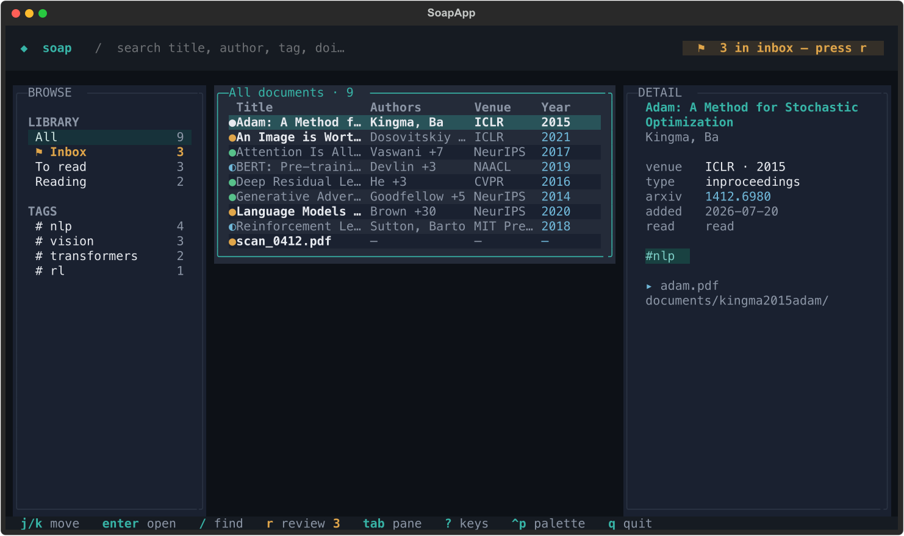

# soap

**soap** is a terminal reference manager for papers, books, and PDFs. Add a local
file, DOI, arXiv ID, ISBN, directory, or URL; fetch metadata; review uncertain
records; then browse, search, tag, and open your library from a keyboard-driven TUI.



## Quick start

### Install

soap needs [uv](https://docs.astral.sh/uv/) and Python **3.14 or newer**.

The simplest way to try the project is from a checkout:

```bash
git clone https://github.com/GhifariArsa/soap.git
cd soap
uv run soap init
```

For a published release, install the `soap-tui` package with uv:

```bash
uv tool install soap-tui
```

Standalone binaries are also published for macOS (arm64) and Linux
(arm64 and x86_64) with each GitHub Release. The installer verifies the download
before placing `soap` in `~/.local/bin`:

```bash
curl -fsSL https://raw.githubusercontent.com/GhifariArsa/soap/main/install.sh | sh
```

The installer requires a published release. Use `SOAP_VERSION=v0.1.0` to pin a
release or `SOAP_INSTALL_DIR` to change the install directory. Before the first
release, use the checkout or PyPI instructions above.

### Add and review one paper

From the repository, prefix commands with `uv run`; an installed copy uses
`soap` directly.

```bash
# An arXiv ID resolves metadata and best-effort downloads its PDF.
uv run soap add 1706.03762

# Fresh `soap init` routes adds through the review queue.
uv run soap inbox review

# Then browse the library.
uv run soap
```

For a local PDF, supply an identifier or metadata yourself:

```bash
uv run soap add ~/papers/paper.pdf --doi 10.1145/3292500.3330701
# Or work completely offline:
uv run soap add ~/papers/paper.pdf --no-fetch \
  --title "Attention Is All You Need" \
  --author "Vaswani, Ashish" --year 2017
```

`soap add --help` and `soap inbox review --help` show the complete option lists.

## The workflow

1. **Initialize once.** `soap init` creates the library, its SQLite index, and a
   shell export for `SOAP_DIR`.
2. **Add sources.** Use `soap add` with a file, directory, DOI, arXiv ID, ISBN, or
   URL. Repeat `--author`, `--tag`, or `--collection` when needed; use
   `--recursive` for a directory.
3. **Review.** `soap inbox review` or the TUI's `r` action lets you accept, correct,
   edit, or skip each `needs_review` record. The CLI also supports deleting a
   record. `--confirm` provides the same guided field correction during `add`.
4. **Browse.** Run `soap` with no subcommand. Use the sidebar for all documents,
   the review inbox, read status, tags, and collections; use `/` to search.
5. **Open and mark.** `enter`/`o` opens the first attached file (or the recorded URL)
   with the operating system's default handler. `m` cycles unread → reading → read.

Metadata lookups use Crossref, arXiv, or Open Library as appropriate. arXiv and
direct-PDF URLs download a PDF on a best-effort basis; an open-access DOI may do the
same. A paywall or failed download does not prevent metadata from being saved. soap
does **not** parse PDF contents.

## Usage

### `soap init`

```bash
soap init
```

The default library is `~/.soap`. `SOAP_DIR` changes the default, and `--path <dir>`
overrides both. `init` creates `config.yaml`, `inbox/`, `documents/`, and `soap.db`,
and writes a quoted `SOAP_DIR` export to the detected shell config (or prints a safe
export line when no shell can be detected).

Useful options:

| Option | Use |
| --- | --- |
| `--path <dir>` | Initialize a different library. |
| `--shell auto\|zsh\|bash\|fish` | Choose the shell config to update. |
| `--force` | Reinitialize an existing library; destructive, but backs up the old database. |

A fresh library sets `always_review: true` in `config.yaml`. Re-running `init` does
not overwrite an existing configuration.

### `soap add`

```bash
soap add SOURCE...
```

`SOURCE` can be a local file, directory, URL, DOI, or bare arXiv ID. ISBN metadata
can be supplied with `--isbn`. Identifiers can also be passed explicitly with
`--doi` or `--arxiv`.

The options most people need are:

| Option | Use |
| --- | --- |
| `--title`, `--author`, `--year`, `--type` | Override metadata. `--author` is repeatable. |
| `--tag`, `--collection` | Add repeatable tags or collections. |
| `--no-fetch` | Skip network metadata lookups. |
| `--recursive` | Include files below a directory source. |
| `--confirm` | Correct the core fields inline before saving. |
| `--edit`, `-e` | Edit the generated `info.yaml` in `$EDITOR`. |
| `--dry-run` | Preview the add without writing anything. |
| `--force` | Add even when a duplicate is detected. |
| `--path <dir>` | Use a library other than `$SOAP_DIR` or `~/.soap`. |

### `soap inbox review`

```bash
soap inbox review
```

The CLI presents one record at a time:

- `a` — accept it as-is
- `c` — correct title, authors, year, type, or venue; Enter keeps a value
- `e` — open the complete `info.yaml` in `$EDITOR`
- `s` — skip it for later
- `d` — delete it and its attached files, after confirmation
- `q` — quit the walk

The TUI review screen uses the same review core. In that screen, `enter`/`a` files,
`c` corrects, `e` opens `$EDITOR`, `s` skips, and `q`/`esc` finishes the review.

### TUI keymap

Run `soap` with no subcommand to open the TUI. Press `?` at any time for the
in-app keyboard reference; the following is the compact map for the main screen.

| Keys | Action |
| --- | --- |
| `j` / `k`, `g` / `G` | Move; jump to top / bottom. |
| `Ctrl-D` / `Ctrl-U` | Half-page down / up. |
| `Tab` / `Shift-Tab`, `h` / `l` | Cycle panes; focus left / right. |
| `Enter` / `o` | Open the selected file or URL. |
| `/` | Search title, author, tag, or DOI; Enter/Tab moves to the list. |
| `e` | Edit the selected document's metadata in `$EDITOR`. |
| `t` | Edit tags. In the tag editor, Enter/comma adds, Tab completes, `Ctrl-S` saves, and `Esc` cancels. |
| `m` | Cycle read status: unread → reading → read. |
| `r` | Review the inbox. |
| `Ctrl-R` | Refresh from disk. |
| `?` / `Ctrl-P` | Keyboard reference / command palette. |
| `Ctrl-T` | Cycle themes. |
| `q` | Quit. |

### Tags and themes

Tags are edited from the selected document with `t` and can be used as sidebar
filters. The TUI ships with `aqua-slate`, `one-dark`, and `catppuccin-mocha` themes.
`Ctrl-T` cycles them, and the choice is saved in `config.yaml`. User themes live in
`$SOAP_DIR/themes/`.

See [the theme format](docs/themes.md) and the
[example theme](docs/example-theme.yaml) for customization details.

## Your library on disk

The library path is resolved in this order:

1. `--path <dir>` where that option is available (`init`, `add`, and `inbox review`)
2. `$SOAP_DIR`
3. `~/.soap`

Its important files look like this:

```text
$SOAP_DIR/
├── config.yaml
├── soap.db                         # rebuildable SQLite index
├── inbox/                          # library directory created by init
└── documents/
    └── <citekey>/
        ├── info.yaml               # authoritative document record
        └── paper.pdf               # attached file(s), if any
```

`info.yaml` is the **source of truth**. Every change writes the document file first,
then synchronizes the SQLite index; the index is only a fast, denormalized view of
the files and metadata. The TUI and CLI therefore read and mutate the same library,
and the on-disk record remains readable and version-controllable without the index.

The review **inbox is a `needs_review` status**, not a second copy of the document:
records and their attachments stay under `documents/<citekey>/` until they are filed,
skipped, or deleted. A new citekey names both the document folder and its `info.yaml`.
Correcting a record during review keeps that citekey; only a new add derives a key.

## More

- [Usage reference](#usage)
- [TUI keymap](#tui-keymap)
- [Release and publishing guide](docs/releasing.md)
- [GitHub Releases](https://github.com/GhifariArsa/soap/releases)
- [Project homepage](https://github.com/GhifariArsa/soap)

## Development

Run the tests with:

```bash
uv run pytest
```

The package distribution is named `soap-tui`; the installed command is `soap`.
